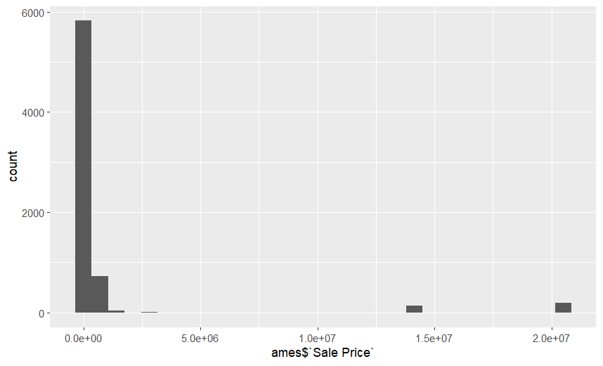
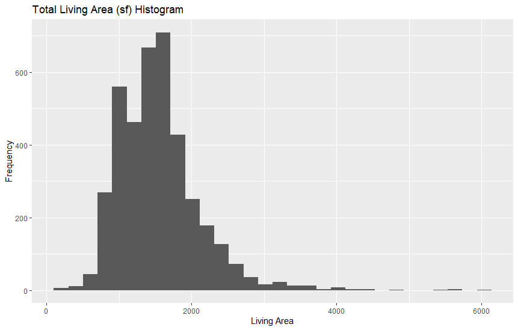
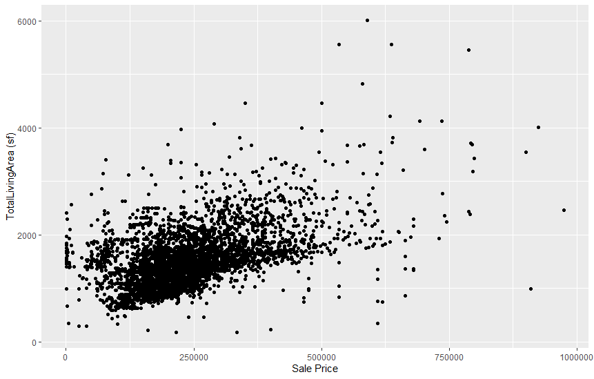

<!-- README.md is generated from README.Rmd. Please edit the README.Rmd file -->


```{r setup, include=FALSE}
knitr::opts_chunk$set(echo = TRUE)
```

# Load necessary libraries
```{r, message = FALSE}
# Load necessary libraries
# install.packages("classdata")
library(classdata)
library(ggplot2)

# Load the residential sales data
data(ames)

# Display the structure of the dataset
str(ames)

# Display the first few rows of the dataset
head(ames)

# Summary statistics of numerical variables
summary(ames)
```


3. The main variable we are focusing on is the Sale Price. The minimum sale price is $0 while the most is $20500000. Most of sales seems like it was under 200k and the upper quartile was $280,000. There are small number of houses sold at very high prices which skews the mean by a lot. 



4.

The variable I picked is the Total Living Area. The range of the data is from 0 to 6007. It seems like most of the living area is between 800 to 2000 square feet. 



It seems like there is a linear relationship between living area and the sale price but without the R^2 value I'm not sure how strongly it is correlated. As the sale price increased the Total Living Area generally increased as well. Many of the houses had 0 living space or sold at $0 which was messing with the scatter plot. I removed the values that had houses sold at $0 or had 0 total living space. In addition, I removed the houses that was sold at a price higher than 1000000 to make the scatterplot look nicer and more readable. The scatterplot below is after removing all those values.


########################################
Subham Bhattacharya 

My variable is bedroom
```{r plot, echo=TRUE}

#Histogram for Bedrooms
ggplot(ames, aes(x = Bedrooms)) +
  geom_histogram(fill = "skyblue", color = "black", bins = 20) +
  labs(title = "Distribution of Bedrooms",
       x = "Number of Bedrooms",
       y = "Frequency") +
  theme_minimal()
```


The above shows a distribution of bedrooms from here we can assume that there are listing with the most of either 3 or 4 bedrooms

```{r bedrooms_vs_sale_price, echo=TRUE}
# Scatterplot for Bedrooms vs Sale Price
ggplot(ames, aes(x = Bedrooms, y = `Sale Price`)) +
  geom_point(alpha = 0.6) +
  labs(title = "Bedrooms vs Sale Price",
       x = "Number of Bedrooms",
       y = "Sale Price") +
  theme_minimal() + 
  ylim(0, 5000000) 

```
From the graph we can assume that there is a linear relation until 4 bedrooms where from 0 to 4 as the number of bedrooms increase so does the price of the house but from their onwards it seems to even out where the price stays almost constant with little increases and decreases.


# Lab report #1

Follow the instructions posted at https://ds202-at-isu.github.io/labs.html for the lab assignment. The work is meant to be finished during the lab time, but you have time until Monday evening to polish things.

Include your answers in this document (Rmd file). Make sure that it knits properly (into the md file). Upload both the Rmd and the md file to your repository.  

All submissions to the github repo will be automatically uploaded for grading once the due date is passed.
Submit a link to your repository on Canvas (only one submission per team) to signal to the instructors that you are done with your submission.
